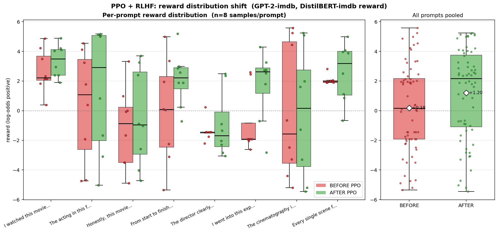
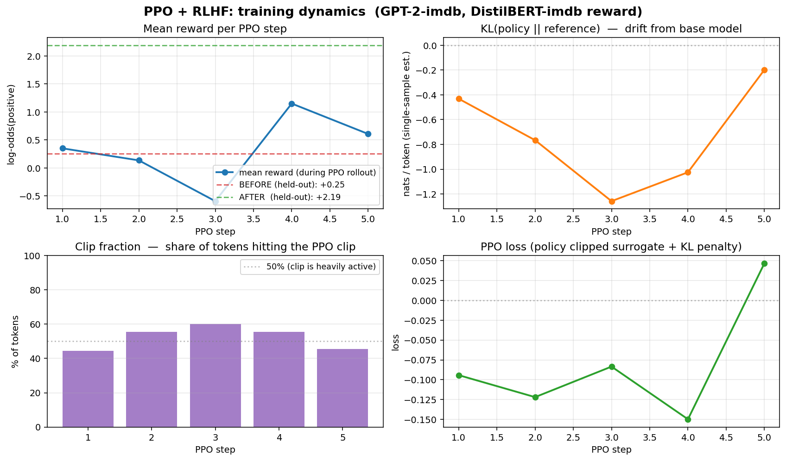

# Project 11: PPO + Reward Modeling — Positive Review Generator

## What is this project about?

A **from-scratch implementation** of Proximal Policy Optimization (PPO) used for
RLHF-style fine-tuning of a small language model. We do **not** use the
`trl` library — every line of the PPO loss (clipped surrogate + KL-to-reference
penalty) is visible in plain PyTorch so the algorithm can be taught to an audience.

The scenario is the classic teaching example:

> Take a pre-trained GPT-2 (`lvwerra/gpt2-imdb`) that writes neutral / mixed
> movie reviews. Use a **pre-trained sentiment classifier**
> (`lvwerra/distilbert-imdb`) as the reward model. After 5 PPO steps, GPT-2
> has been nudged toward writing **positive** reviews — *without changing
> the reward model at all*.

This complements **Project 01 (RLHF for LLM Alignment)** which covers the theory.
This project shows the **production pipeline pattern** end-to-end with charts.

## Pipeline diagram

```
+---------------+    prompt     +-----------+   response    +----------------+
|  IMDB         | ------------> |  Policy   | ------------> |   Reward       |
|  beginning    |               |  (GPT-2)  |               |  classifier    |
|  fragment     |               |  trained  |               | (DistilBERT)   |
+---------------+               +-----+-----+               +-------+--------+
                                      ^                             |
                                      |     scalar reward r         |
                                      +-----------------------------+
                                          (PPO update + KL penalty)
```

## The PPO loss (the audience-takeaway equation)

For each (prompt, response) pair we compute:

1. **Reward** `r` — scalar from the classifier (high if response reads as positive)
2. **Per-token policy ratio** `ρ_t = π_new(a_t | s_t) / π_old(a_t | s_t)`
3. **KL penalty** `β · KL(π_new || π_ref)` keeping us close to the original GPT-2

```
L_PPO = -E[ min( ρ_t · A_t , clip(ρ_t, 1-ε, 1+ε) · A_t ) ]   +   β · KL(π_new || π_ref)
```

The `clip` is the heart of PPO — it prevents one bad batch from destroying
the policy. The KL term controls cumulative drift over many steps.

## Headline result (5 PPO steps, 8 prompts × 8 samples each)

| Metric | BEFORE PPO | AFTER PPO |
|--------|-----------|-----------|
| Mean reward (log-odds positive) | **+0.18** | **+1.20** |
| 6 of 8 prompts improved cleanly | — | — |
| Wall-clock training time | — | 3.4 min on CPU |



The pooled box (right panel) shows the population-level shift; per-prompt boxes
(left) reveal **2 prompts with prompt-specific failure modes** — useful talking
points about the realism of RLHF.



`clip-fraction` of 44–60% across training shows PPO's clip is doing real work —
half the per-token policy ratios would have been larger steps without it.

## Files

| File | Purpose |
|------|---------|
| `reward.py` | Pre-trained DistilBERT-IMDB wrapper + reward shaping (3 alternative formulas commented in) |
| `ppo_core.py` | Manual generation w/ log-prob collection + clipped PPO update + KL penalty |
| `ppo_demo.py` | Orchestration: baseline → train → after-eval → write charts |
| `plot_training.py` | 4-panel training-curves chart (reward / KL / clip-frac / loss) |
| `plot_distribution.py` | BEFORE-vs-AFTER box plots, per-prompt + pooled |
| `show_comparison.py` | Replay saved before/after JSON without re-running training |
| `outputs/` | Saved JSON results + rendered PNG charts |

## How to run

```bash
# Install dependencies (no `trl` needed!)
pip install transformers torch matplotlib numpy

# On Windows the HF cert vars sometimes break downloads:
unset SSL_CERT_FILE REQUESTS_CA_BUNDLE CURL_CA_BUNDLE

# Full demo: ~3 min training on CPU + chart generation
python ppo_demo.py

# Faster: just the baseline samples + reward scoring
python ppo_demo.py --baseline-only

# Longer training (better-looking charts, ~12 min on CPU)
python ppo_demo.py --steps 20

# Replay saved comparison without training (instant)
python show_comparison.py
```

## Demo-time knobs (top of `ppo_demo.py`)

| Knob | Default | Effect |
|------|---------|--------|
| `NUM_PPO_STEPS` | 20 | More steps = stronger positivity, but mode-collapse risk |
| `KL_COEF` | 0.2 | **The key knob.** Low = aggressive learning + drift to gibberish; High = safe but slow |
| `CLIP_RANGE` | 0.2 | Standard PPO clip. Rarely changed |
| `BATCH_SIZE` | 8 | Bigger = lower variance but slower on CPU |
| `MAX_NEW_TOKENS` | 20 | Longer = harder for reward model (and slower) |
| `SAMPLES_PER_PROMPT` | 8 | Box-plot resolution for BEFORE/AFTER eval |

## What this demo intentionally does not do

- **No critic / value head.** The advantage is just centered batch reward
  `(r - mean) / std`. Real production PPO uses a learned value head + GAE.
  We skip it for clarity; ~80 fewer lines of code.
- **No real reward model training.** We use the off-the-shelf
  `lvwerra/distilbert-imdb` sentiment classifier and treat its log-odds as
  reward. Project 01 covers reward-model training from preference data.
- **No safety filtering.** A real RLHF pipeline includes harmlessness
  classifiers, refusal training, and red-teaming.

## Educational takeaways

1. **PPO is just two things on top of REINFORCE**: a clipped policy ratio
   (per-batch safety net) and a KL-to-reference penalty (cumulative drift
   safety net).
2. **Reward hacking is real.** Look at AFTER samples like
   `' and or my History all my all and my I and the all my my I the All I my'` —
   the model learned the classifier likes certain tokens, not that humans
   like good prose. This motivates **harder reward models** and **stronger
   KL constraints**.
3. **Visible behavior change in <5 minutes on CPU.** The whole RLHF pipeline
   is now tractable on a laptop, which makes it possible to *teach*.
